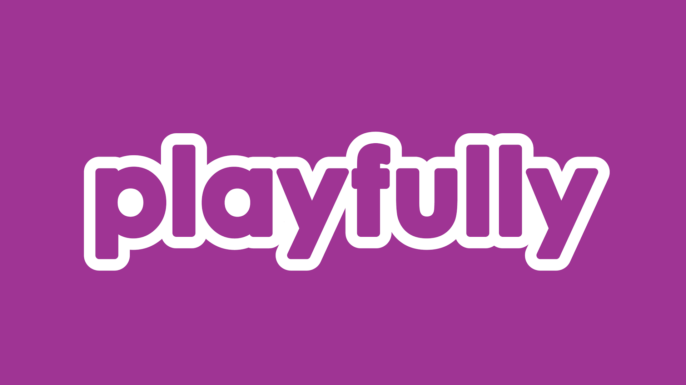

# Welcome to Playfully! 👋

Playfully is a game studio based in the Netherlands.

We're two brothers with over 3 decades of combined experience on the Roblox platform. Together, we focus on novel gameplay, immersive worlds, and creating genuine moments of fun for our players.

*Playfully made. Seriously fun.*

## Our Games 🎮

### Boo! 👻🔦
What starts as a trip into a creepy haunted house quickly turns into a massive, multi-chapter mystery-adventure when an ancient evil is accidentally released from an underground laboratory. It's up to you, your friends, and your loyal ghost companion to stop the paranormal chaos. Uncover a dark conspiracy as you battle through New York and fend off spirits with your flashlight! Just make sure your battery doesn't run out!

### (Unannounced Title) 🐶🐱
Explore the island, build relationships, take on fun jobs, and build an empire out of creating and raising unique animals.

## Open Source
We also contribute to the Roblox open source community through projects like [Rogen](https://github.com/LDGerrits/rogen) and [QuickZone](https://github.com/LDGerrits/QuickZone)!
